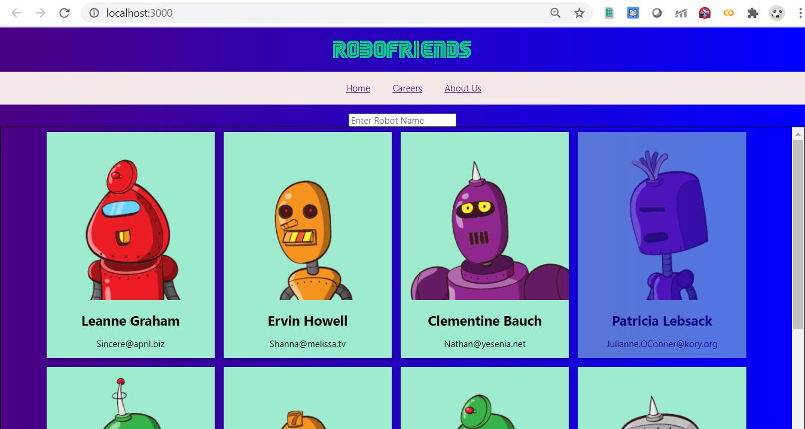
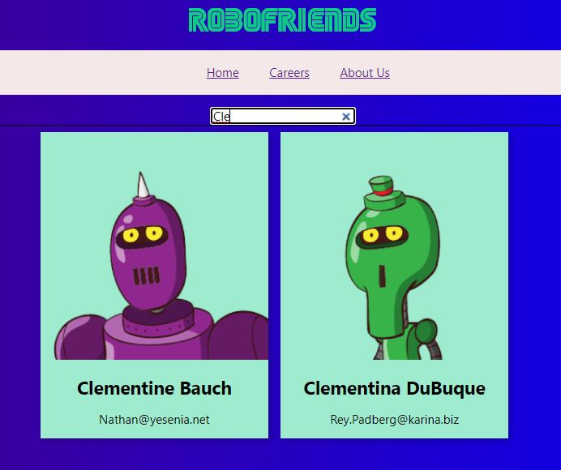

# ROBOFRIENDS:(A React.js App)

This project was done while doing the **Udemy Course:The Complete Junior to Senior Web Developer Roadmap (2020)** by **Andrei Neagoie**

##  ScreenShot
 

**Searching using robot name:**
 

## Running instructions
  >Clone Project
  >npm install
  >npm start 
